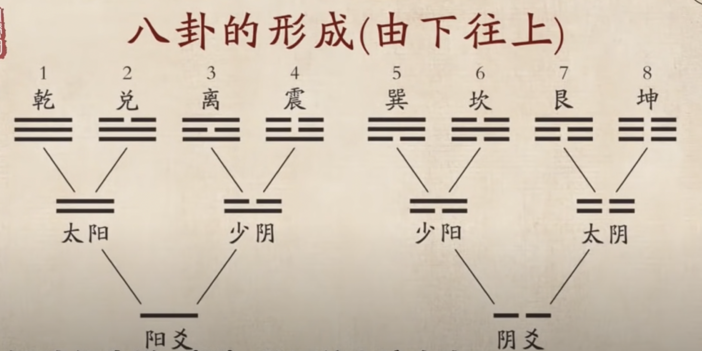
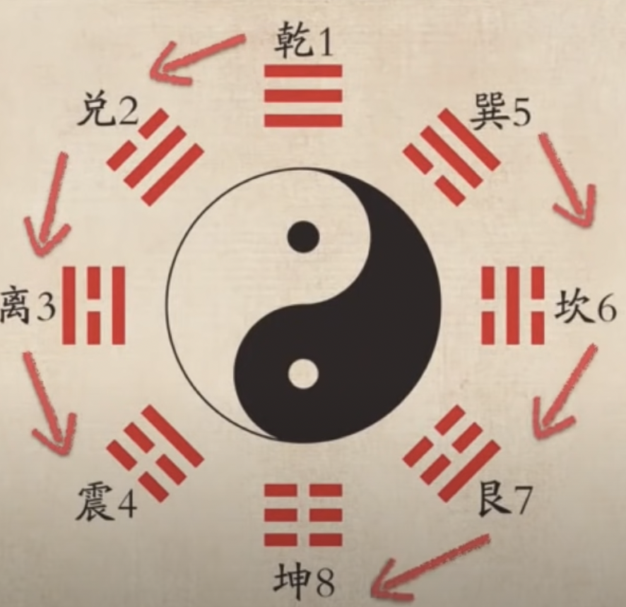
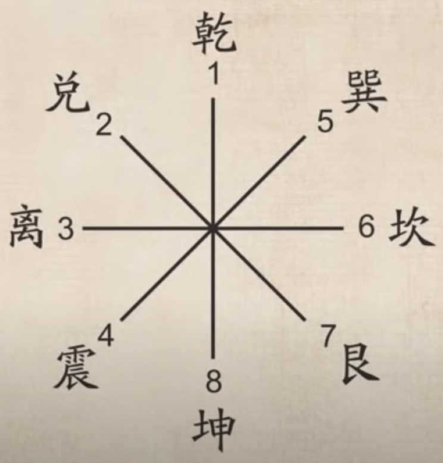
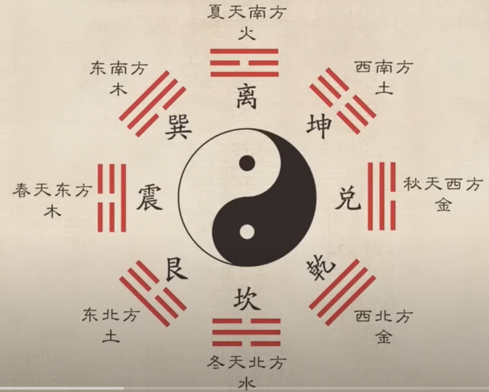
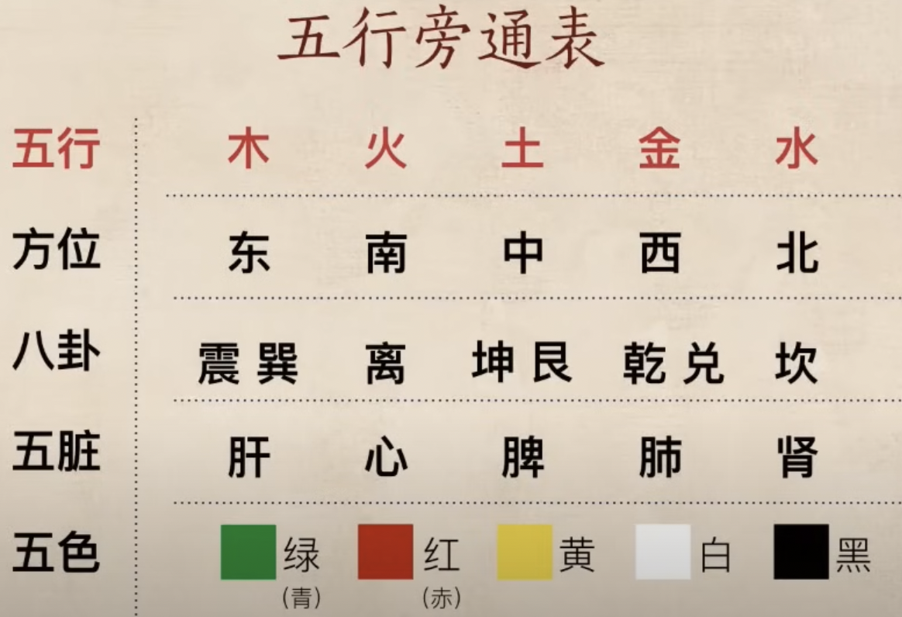
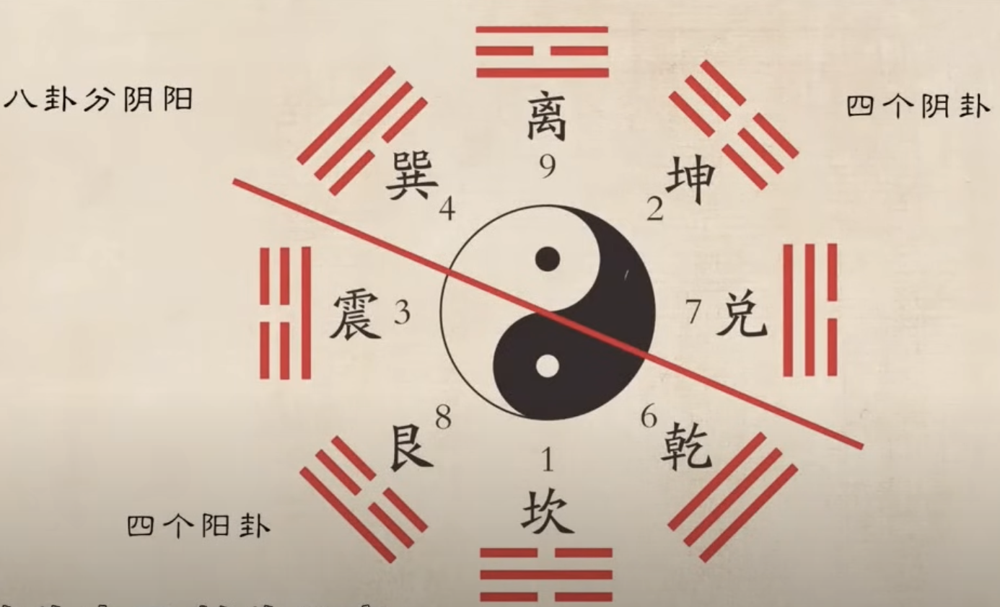
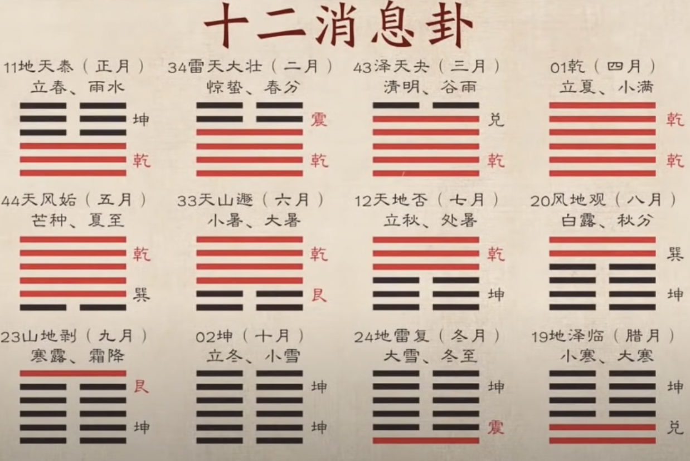

# 易經入門
- [Link](https://www.youtube.com/playlist?list=PLvh1kerK7RltFQ0ksku461xvuUdqiy0Rx)

## 先天八卦口訣
乾三連（☰），坤六斷（☷）；
震仰盂（☳），艮覆碗（☶）；
離中虛（☲），坎中滿（☵）；
兌上缺（☱），巽下斷（☴）。

## 易
前兩者已失傳，現代易經通指周易
- 夏：連山易
- 商：歸藏易
- 周：周易

### 兩派六宗
- 義理派（玄理、`儒理`程朱學派、史事學派）
- 象數派（`占卜`、磯祥(預言)、圖書(河圖洛書、風水、設計)）

## 卦詞
西伯昌（姬昌）被關在陝西監獄，每一卦寫一句話，稱作「卦詞」，每一卦六爻，64卦乘以6，共384爻，每一爻一句話稱「爻詞」

- 伏羲做卦,周文王卦辭,孔子統整

## 易經內容
- 是古代中國巫師用於推演未來吉凶禍福的卜筮書
- 義理：`居安思危、樂天知命`
  - 「樂天知命」，天：大勢所趨，命：個人遭遇，天為時，表大格局，命為位，爻是位置，樂天：面對大勢以樂觀正向態度面對，不管你喜不喜歡並非個人能考慮的，知命：了解自己的情緒，理解並了解自己
- 象數：無有師保、如臨父母（卦象、數字，用以占卦）
  - 師、保為古代官員，古時只有貴族能讀易經，師氏教導貴族，保氏保護貴族，長大後稱：無有師保，面對易經占卦如臨父母，面對未來，未來不可知，故須占卦

> 老子曰：信言不美、美言不信

### 尚書-洪范篇
古代帝王使用易經解決問題

### 易經卜卦為何準確
- 共時性、歷時性原理：同時發生的事，其實有內在關聯
- 有意義的偶然，越是偶然越準確，心電感應

## 八卦之象徵
### 家庭上
- 乾為父，坤為母
- (卦由下往上畫，物以稀為貴)
- 震長男，坎中男，艮少男
- 巽長女，離中女，兌少女

### 身體上
- 乾為首，坤為腹(跟母親、土地有關)
- 震為足，艮為手(兄弟如手足，足比手大)
- 離為目，坎為耳(離為火、光亮、眼睛，坎為水、低處流、流入聲音、耳)
- 兌為口，巽為股(兌為澤、上開口集水、口，巽為風、重要聯繫、股-大腿)

### 動物上
- 乾為馬，坤為牛(馬主動力強，牛非常順從)
- 震為龍，艮為狗，坎為豕(忘子成龍，山、狗擋住，豕ㄕˇ:大豬，豬喜歡水)
- 巽為雞，離為雉，兌為羊(雞養一群，客人來殺幾隻不會抗議，雉:野雞, 羽毛彩色像火一樣，羊: 柔順)

### 基本性質意義(最重要)
- 乾為健，坤為順(剛強主動、陰柔被動)
- 震為動，艮為止(足動、山靜)
- 離為麗，坎為陷(火不會獨自燃燒、其必有依附、麗: 依附，水中可能有陷阱危險)
- 兌為悅，巽為入(兌現鈔票快樂、看到沼澤可取水喜悅，巽為風無所不入、一帆風順)

## 易經的結構
- 經
  - 上經：30卦
  - 下經：34卦
- 傳
  - 彖(tuˋan): 卦辭
  - 象
    - 大象: 解釋卦辭
    - 小象: 解釋6爻之爻辭
  - 文言: 只解釋乾坤卦
  - 系詞: 易經的哲理(哲學)
  - 說卦: 八卦卦象具體說明
  - 序卦: 64卦排列順序說明
  - 雜卦: 從卦形看卦與卦的聯繫

## 64卦卦名次序歌
- 乾坤屯蒙需訟師，比`小畜`兮履泰否。(屯zhun,比ˋbi,否ˇpi)
  - 屯: 萬物生發
  - 蒙: 啟蒙
  - 需: 等待，啟蒙完不著急、先吃飽喝足再說
  - 訟: 吃就出現爭訟
  - 師: 爭訟出現群眾、軍隊
- `同人``大有`謙豫隨，蠱臨觀兮`噬嗑`賁。(蠱ˇgu,嗑ˊhe,賁ˋbi)
  - 噬: 咬斷
- 剝復`無妄``大畜`頤，`大過`坎離三十備。(頤ˊyi)
  - 坎也是兩字，在這省略為一字，故64卦中共有16個雙字卦
- 鹹恆遁兮及`大壯`，晉與`明夷``家人`睽。
- 蹇解損益夬姤萃，升困井革鼎震繼。(蹇jiˇan,夬guˋai,姤gˋou)
- 艮漸`歸妹`豐旅巽，兌渙節兮`中孚`至。
- `小過``既濟`兼`未濟`，是為下經三十四。

### 自創諧音方便記憶
- 乾坤尊盟須頌詩，必`小續`溪履泰否。
- `同人``大有`簽欲隨，股臨關西`適合`閉。
- 剝復`無望``大續`疑，`大過`砍梨三十倍。
- 閒恆頓膝急`大撞`，禁與`明儀``佳人`睽。
- 減解損益怪構脆，升困井閣頂震劑。
- 更見`歸妹`瘋旅續，兌換節希`終福`至。
- `小過``既計`堅`未計`，誓圍嚇驚三十四。

## 八卦的形成(由下往上)
數字怎麼來的
- 左陽右陰，往上疊加
- 以新加上去為取名考慮，故少陰、少陽

- 乾兌離震、巽坎艮坤

- 對角線相加都是9

- 第三組決定哪個爻在變，變爻代表這卦有六爻，哪個爻變了，代表哪個爻起作用，答案就在該爻辭裡面

## 數字卦
### 提問
提問題必須非常明確，比如想問孩子該不該去美國念書，不能問「孩子要不要去美國念書？」，應該問「孩子去美國念書，結果怎麼樣？」
### 操作
隨機想到三組3位數（問題先別說，先給數字），數字卦由下往上寫
- 第3組除以6，取餘數（整除取6），此為變爻（上下卦出來只有6爻，故除6，同樣由下往上數）
- 第2組除以8，取餘數（整除取8），此為上卦
- 第1組除以8，取餘數（整除取8），此為下卦
### 範例
- 3: 324 % 6 = 6 => 上六
- 2: 980 % 8 = 4 => 震
- 1: 280 % 8 = 8 => 坤
推導出「雷地豫」「下坤上震」，故雷地豫上六的爻辭就是問題的答案
- 問題是：「有一個國資企業想投資入股我的企業，如果同意的話結果如何？」
- 豫，指河南，代表喜悅、愉悅、開心，也同時代表預備，有一定風險，在開心的同時須小心，上六為「冥豫，成有渝，無咎」，莫名的開心，事情有可能生變，事情在不太了解的情況下，覺得很開心，但已到最高位置，這種不清楚的情況不會太久，只要答應了很快就成，但此卦只有一個陽爻94，這事要看主爻支不支持，若支持就大有可為
### 注意
因為對數字會敏感，盡量不讓自己刻意去想數字，靠偶然想到的會比較準
### 解卦須知
先看卦的基本性質，知格局，答案以占到的爻辭為主，注意三爻變，卜卦時爻變須謹慎使用，有時也是必須的，當你解不開、或是爻變後有什麼幫助時就需要考慮（每一個爻都可以爻變），爻變指陽盛極轉陰、陰盛極轉陽的爻（老變少不變）
### 高手解卦
易經最早只有圖畫、沒有文字，一流高手只需看卦象，但難度非常高，格局不夠容易原地打轉

## 硬幣卦
正面有朝代文字(或人物頭像)，朝代或人物會結束或死亡，故亦主陰，而背面的幣值數字(一文或十元)是常存不滅的、並無所謂的生死，故背面屬陽，取三枚硬幣合在一起，在無障礙物平地上，手中搖晃後拋下，紀錄次序由下往上，一陽兩陰稱少陽，兩陽一陰稱少陰，四種情況機率分別對應到八卦關係，三正、三反、一正兩反、一反兩正分別為 1:1:3:3，其中老陽、少陽記做（一），老陰、少陰記做（--），另在老楊、老陰旁做個標記（變爻）

重複六次取得6個爻，組成一卦，由下而上排列，得到本卦、之卦（變爻後）

### 爻變
若三個硬幣皆為陽、陰面，物極必反，需變爻為對立面（三陽稱老楊，三陰稱老陰），會有幾種不同情況
- 六爻皆不變，以本卦卦辭解
- 六爻皆變，以之卦卦辭解
- 只有一爻變，以該變爻爻辭解
- 只有一爻不變，以該不變爻爻辭解
- 變爻多於不變爻，以之卦卦辭解
- 變爻少於不變爻，以本卦卦辭解
- 變爻等於不變爻數量，同時以本卦、之卦卦辭解

> 陽性動而陰性靜；陽是否定，陰是肯定；陽是生，而陰是長；陽是開，而陰是承；陽是質變，陰是量變，質變是否定，量變是肯定

> 易經是以「物以稀為貴」最為基準，故一陽兩陰為少陽，屬陽象卦，原來易經是認定團體中最尊貴的領導者是唯一的、最具代表性的，其餘的都是被領導的；故只有一陽爻的震卦、坎卦、艮卦是屬陽象卦，只有一陰爻的巽卦、離卦、兌卦是屬陰象卦

### 分析重點
- 卦定時（格局）
- 爻定位（當位、乘承、應）

## 易無定估(言字邊)
學卦容易，解卦難，沒有固定的解法，學易經解卦只說明事實，不要給予太多個人臆測建議，專注在解釋看到的卦象結果，畢竟對於易經來說甚至死亡都不是一件壞事，占卦得到了結果也不要太走心，刻意想去迴避一些事情，也不一定迴避了就好，遇到難關後可能一展鴻圖，故`解卦一定要避免任何迷信的心態，知道事實結果後，重在修煉自己，不迷信`

> 曾仕強教授【占卜不迷信】(https://youtu.be/ixdauJp_GEc?feature=shared&t=1108)，占卜如果只重視吉凶的結果，那就是消極地聽天由命，所謂【潛龍勿用】並不是永遠不露出才幹，而是站在不露的立場【露】，當仁不讓(站在禮讓的立場不讓)，養身不如養藏

## 占驗之詞
卦爻辭對吉凶所下的斷語，比如乾卦初九、潛龍勿用，勿用為占驗之詞，潛龍是此爻的現象
- 吉凶悔吝
- 上
  - 元吉、大吉、吉
- 中
  - 無咎(正常情況)
  - 悔(過失而悔、懊惱，懊惱沒關係，知道懊惱、悔恨後可能走向無咎、吉)
  - 吝(困難，路走不通，一意孤行可能走向兇)
- 下
  - 厲(危險，危險不一定兇，提高警覺可避開)
  - 咎(災難)
  - 兇

## 學易經的目的
占卦到不好結果沒關係，三個月後再試，三個月是一個季節，季節改變一切都改變了，易是會變的，可以每三個月幫自己占一次時運，心想事不成很常發生，占得結果好：放手做，結果不好：收斂，作為一種修煉自己的過程，所以學易經的目的，並不是疑神疑鬼、追求迷信，而是一種修煉自己的機會，當你在遇到不好的事情時學會面對、解決、增長智慧、調整自己，在占卦之前，必須先靜下心來，確認內心，嚴肅看待每一次的占卦

### 三不占原則
- 不誠不占，占完要重視祂
- 不義不占，不正當的事不要問（比如問某人有沒有私房錢）
- 不疑不占，不是真正的疑問不要問

### 解卦三不(傅佩榮老師自律)
- 不搞神秘（解卦不能消災解厄）
- 不給建議（不偏離卦象事實，能回答問題的只有提出問題的人）
- 不涉利益

### 天道無吉兇
- 太年輕占一生，沒有太大的意義，就跟算命一樣，就算算準，實際這一生每一天該面對的喜怒哀樂還是要過，是不會少的
- 很多人以為學了易經之後從此逢凶化吉，實際是修煉自己最重要，當你德行、修養、品德達到後，遇到什麼困難都不是問題，`「天道無吉兇」`自然界的運作沒有所謂的吉兇，單`看人本身是否能從中學會教訓`，學會那就逢凶化吉，學不會即使吉也沒有太大的用處

### 算命悖論
因為算命本身在預測未來，比如預測你考試是否會上榜，結果你因為算命結果會上榜而不用功唸書，最後落榜，很多人會怪罪算不准，認為應該算結果是不會考上，但對易經來說沒這問題，易經本質不是在憑空預測未來，而是`針對你的某一種選擇描述出結果，因為你只有按照原本你要去做的方向去做事，才能夠驗證占卦的準確`，而人往往在選擇時有彈性，如果占卦後選擇另一個方向去做事，那與易經占卦的結果本質上已無關係，故易經不適合用算命悖論來說

### 解卦建議
可以把自己解出來的卦都記錄下來，後面可以驗證準確程度，藉此提升自己解卦的能力與水平

## 時與位
### 時
萬物在變化流轉之中，人對「時」之判斷與掌握，是成事的關鍵，吉兇之樞機。卦為時，代表一個格局。

### 位
爻為位置，以中最好(2, 5)，位有剛柔，爻有陽陰，奇數為剛爻，偶數為柔爻
- 陽爻在初、三、五，陰爻在二、四、上，稱「當位」、「正」
- 乾卦92，不當位，但「中勝於正」，位置居中所以不當位也沒關係，故「中」始終是最好，其次看當位
- 下卦三爻、上卦三爻能不能陰陽相應，互相扶持

### 爻的位置與好壞
- 上爻準備要離開（低調、惆悵），吉的只有 1/4, 3/4都不怎麼順利
- 初爻剛上場，不好也不能怪他
- 四爻普通
- 最壞的位置為「三」
- 最好的位置為「五」，王位，64卦中只有3個此位置不好
- 次好的位置為「二」，5個此位置不好

### 九代表陽爻、六代表陰爻
- 陽爻是奇數，代表不穩定，13579中，以9最有動力
- 陰爻是偶數，代表穩定、平均，246810，以6最穩定，在中間
- 或以生數12345來解釋，1+3+5代表陽爻，2+4代表陰爻

### 三才
- 天、人、地三才，構成一個格局，初、二代表地，三、四代表人、五、上代表天

### 內外卦
- 下卦又稱內卦，主內在
- 上卦稱外掛，主環境

### 乘與承
- 上對下稱乘，反之稱承，一般認為陰承陽為佳，反之不順
- 參照頤卦，初、二若陽爻在下、陰爻在上，則稱為「乘剛」（注意：沒有「乘柔」這個字），通常沒有不好，除非主爻是它，而被乘那就不利

### 比與應
- 比：鄰居，作用較小
- 應：上下卦三爻位置互相影響
  - 正應：一陰一陽
  - 不應：非一陰一陽
  - 兩爻應、一爻不應，則該爻委屈
  - 兩爻不應、一爻應，該爻佔優勢

### 覆卦與變卦
64卦兩兩一組，兩個兩個非覆即變
- 乾卦六個陽爻，坤卦六個陰爻，稱為變
- 屯卦與蒙卦上下顛倒，稱為覆
  - 不變的四卦：乾、坤、離、坎

### 互卦
- 一個卦除了上下卦，其中234爻、456爻又可以視為一個卦，稱為互卦
  - 比如234為坤卦，則稱為互坤

### 易經四大難卦
- 屯卦、坎卦、蹇卦、困卦，每一個裡都有坎卦，占到坎卦要提高警覺

## 後天八卦圖
一般認為是周文王在陝西時所畫，與中國地圖地形可以配合著看，易經是從北往南看，東在左手邊為震，南方熱為離火，西邊青海附近很多沼澤故為兑，北方冬天寒冷為坎

### 八卦配五行
此順序與中醫的`木火土金水`相生相克原理相通

### 五行旁通表

### 後天八卦與易經
- 八卦分陰陽（西南皆陰卦、東北皆陽卦），卦辭常會說`利西南、不利東北`，實際上就是宜柔順、不宜陽剛之意，出自這邊

## 消息卦
卦的變化來自於消息卦，正好十二個對上農曆的十二個月，`同樣性質的爻從下往上，跟不同性質的爻不交錯`
- 消-消退、息-成長
- 春季：農曆 1-3月
  - 地天泰（三陽開泰）
  - 雷天大壯（四陽爻壯）
  - 澤天夬（一陰爻）
- 夏季：農曆 4-6月
  - 乾（陽氣充滿領域，還不是最熱）
  - 天風姤（最熱時，陰爻已出現）
  - 天山遁（四陽爻準備離開）
- 秋季：農曆 7-9月
  - 天地否
  - 風地觀
  - 山地剝（植物都開始剝落）
- 冬季：農曆 10-12月（坤、地雷复、地澤臨）
  - 坤（全陰爻，還不是最冷）
  - 地雷复（最冷時，陽爻從下出現）
  - 地澤臨（四陰爻準備離開，迎接春天）

### 消息卦看趨勢
占卜到消息卦一定要看趨勢

## 主爻
易經占卦的主爻，主要是根據《易辭》來的思想選，64卦每個卦都有固定的主爻，這個主爻是有一定規律的。基本上越難找的主爻越沒有什麼作用，越明顯的主爻對其他爻的影響越大，解卦時就需要特別注意

第一、遵從`物依稀為貴`的原則，如地水師卦上坤下坎，六個爻中只有九二為陽爻，所以這個爻是該卦的主爻。其餘64卦中如有唯一的陽爻或陰爻的就是做為該卦體的主爻。

第二、`中位、中正原則`，即當卦中陰陽爻的比例為2比1的時候，即4個陰爻2個陽爻或4個陽爻2個陰爻，我們則看那佔比少的2個爻中，哪個爻位於上下卦的中間位置就是主爻。如果兩個爻都是在中位，則看那個爻同時還是正位，即陰爻在陰卦、陽爻在陽卦。這個即中且正就是主爻。比如地澤臨卦，就是初九與九二都是陽爻，則取九二為主爻。

第三、就是陰陽爻的比例一樣，或者全陰全陽，就根據第二條`找中正位的同時看這個爻的正應`。就是看它是否與上卦或下卦相同位置的爻陰陽相互呼應，即是否異性相吸，如果相吸，就是正應。

第四、就是上述三條都沒有的話，那就要看哪個爻的`爻辭與卦辭的意思`相同或者基本接近，`意思相同或者接近`的爻肯定就是主爻。

## 其他
- 十三經注疏
- 易經
- 易傳
- 易學(把易經應用於各種知識層面的學問)
