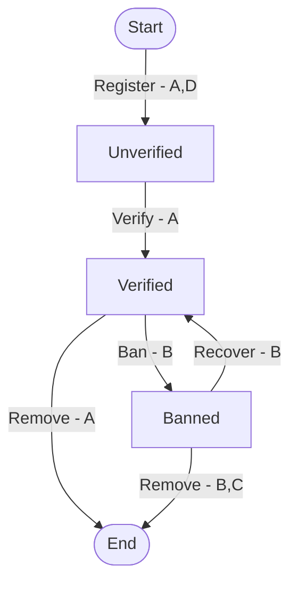

# API First 學習筆記

哈摟大家好～我是 Johnny。

今天這篇是觀看 `91APP 首席架構師 Andrew Wu` 有關於 API First 的介紹影片時的觀看筆記～

影片連結在這邊！[DevOps 潮流下的 API First 開發策略](https://www.youtube.com/watch?v=xDMTP2OVROo)，歡迎有興趣看看的朋友可以看一下～

<YoutubeVideo src="https://www.youtube.com/embed/xDMTP2OVROo" title="DevOps 潮流下的 API First 開發策略" />


## 什麼是 API First
指得是 API 的順位要擺在第一考量，推動 API First 的要素有以下三點

- 先做好 API(Developer Experience)，再做好 Product
- 系統間的通訊方式就是 API 的規格，避免直接互相存取儲存空間等等
- 誰訂 API Spec?誰來訂都沒關係，重點在確立 Contrast


## 為何需要 API First
API 背後代表的是使用 `服務`、`資料` 的標準方式，高度整合能夠帶來便利、自動化、規模化，也更易於開放 API 給其他客戶、異業進行合作


## 產品團隊難題
為了區分 `服務`、`應用` 的分界，必須確立哪些東西是需要收斂成 API 服務的？而哪些該被當成客製化需求交付，而不應該是通通寫進標準產品當中。


## AWS 的 `API 授權` 備忘錄(2002年)
- 所有團隊必須以服務介面連接埠的方式，提供彼此系統間的資料和各種功能
- 不允許任何其他形式的互操作，不允許直接連結，不允許直接讀取其他團隊資料，不允許共享儲存空間，不允許任何形式的後門，`唯一許可的方式就是透過網路呼叫服務`
- 具體的網路實作技術不侷限在 HTTP
- 所有的服務連接埠，必須從一開始就以可以公開作為設計導向，也就是在設計時就預設可以對外部人員開放使用
- `不遵守上述規定者，一律開除`

備忘錄的真正含義，考量的並不單純僅僅是複用性的問題，而是作為一家科技公司，其`資產就是對於專業領域的資訊處理能力`，API 不論對內、對外都是最適合作為提供服務的型態，為了讓公司服務能夠更容易被運用，這是整個商業運作的骨幹不可妥協，故`不遵守上述規定者，一律開除`


## API 開發策略
- 開發流程改變  
  - `Contrast First` (vs Requirement First)
- 分析設計方式改變  
  - 從 Domain 的 action, model 分析開始，非 db schema 開始
  - API 背後的細節需要被封裝，降低整體系統溝通複雜度
- 安全控管的改變  
  - scoped + api-key (vs function-list + 授權 + 帳號)
  - 功能開關，轉變為領域操作授權
  - API 安全性做得有多確實，決定整個生態系的安全性(oauth 的授權同意功能)


## 開發流程改變
先討論 api schema，API 基於 mock 先行提供(能有 swagger 更讚)，前後端同時開發，也可更快找到原本設計上不合理或缺失的地方


## API 設計方式的改變與標準化
- 練習先找出關鍵的 API 結構，排除非必要的細節設計
- 關鍵 API 先出來後就能先進行案例驗證，完成後再展開細節設計
- 細節包括：參數定義、實作技術、組合 API 等等


## 設計 API 的核心結構 - 狀態機
- 找出 domain 最關鍵的行為（不用急著找出全部）
- 以 OOP 思維，將服務降維思考成 `物件 = states + methods`
- 用 `狀態機` + `實例化案例` 來確認 API 骨架是否正確合理，再展開為 Spec

### 參考圖
以下透過簡單的經典登入狀態機來說明如何設計

根據狀態機我們可以得到這些細節（抱歉本人習慣用 Typescript 寫ＸＤ請多包涵，僅供參考）
```typescript
// 列出 states
type AccountStatus = 'Unverified' | 'Verified' | 'Banned';

// 列出 actions
interface Register {}
interface Verify {}
interface Ban {}
interface Recover {}
interface Remove {}

// 列出 Get actions（不改變狀態）
interface Get {}
interface GetMasked {}

// 列出 Caller 為後續權限管控的機制設計
enum Caller {
  A = '會員本人'
  B = '營運人員'
  C = 'Service(自己)'
  D = '3rd'
}

// 列出 Event 監聽改動後需要相應觸發的事件
// 實作可用 message bug, webhooks or etc.
interface OnRegistering {
  (
    id: string,
    initState: AccountStatus,
    finalState: AccountStatus
  ): void;
}
interface OnRegistered {
  // ...
}
interface OnAccountStatusChanged {
  // ...
}
```
最終開出類似下方的 api 規格，事後需要修改需求時，只需要拿出這個狀態機參考改動就可以快速釐清目標跟改動範圍
1. `API: POST /api/members/{id}:{action}`
2. `API: GET /api/members/{id}:{action}`
3. 更多可透過 1. + 2. 組合成的好用服務，確保行為一致

### 權限管制表
狀態機中的權限雖然方便，但無法一目瞭然，可以再另外整理一張表格，加速溝通理解的速度，具體像是 `Remove` 這個 action，在 `AccountStatus` 不同的狀態下，權限設定是不同的

||Register|Verify|Ban|Recover|Remove|
|:--|--|--|--|--|--|
|A. 會員本人|start:*|unverified:*|||verified:*|
|B. 營運人員|||verified:*|banned:*|banned:*|
|C. Service(自己)|||||banned:*|
|D. 3RD|start:*|||||

> Think: 如果我想控制`只允許內部使用的 API`，該怎麼做？

### 實作收斂
上面的表格雖然精美，但實作上 `5x4` 的這樣排列組合 action 是很可觀的，需要經過 scope 收斂，比如 action 透過 `CRUD` 收斂，caller 透過 `api-key` 收斂等等。具體關於 API Access Scope 的案例可[參考這邊](https://developers.smartrecruiters.com/docs/access-scopes#list-of-available-access-scopes)，文章後面會提到如何實作這部分～

### API 需求驗證
到這階段，我們可以拿著剛剛製作好的狀態機，開始一一驗證 PM, PO 開的 API 需求是否都有滿足了，這個過程基本上都還是紙上作業，驗證速度比起實際開發後才做比對修改會快上非常多

### 對比 CRUD


## 從 API 設計階段考慮安全性
這邊定義的安全性是 `能被刻意利用，用來影響正常運作的任何因素`。這邊討論的不是基礎建設的資安問題（加密、二次驗證），而是 API 設計上是否讓商業邏輯本身有漏洞存在。

### 授權管理
**授權管理的原則：**
1. 需知道每個 API 呼叫是來自哪個 caller？  
常見做法：每個 caller 配發 api-key 識別
2. 產生 的 api-key 把 scope 綁在上面，並儲存在 db, redis 等處，當需要時進行反查

**安全風險考慮**
1. 會異動資料的 API
2. 會異動狀態的 API
3. 會取得個資或機密資訊的 API
4. 會列舉資料（大量）的 API

### 認證管理
**常見措施：**
1. 集中式：API Gateway, Ingress
2. 協作式：Service Discovery
3. 分散式：Service Mesh

**對內、對外應有不同的 api-key 管理機制**
以車票、識別證兩種不同的比喻方式類比
- 車票：不論誰拿到，都能使用上面記載的服務內容，車票本身可進行驗證真偽
- 識別證：票券本身證明持有者身份，至於服務內容則透過服務供應者根據其身份進行權限管制


### 題外話 What is AC?
> 聽到這邊突然想起最近在公司內部上過的 Workshop - `What is AC - Acceptance Criteria 驗收條件`，發現有許多異曲同工之妙。但 AC 更著重在事前的整個實例討論，在事前準備工作上需要花費更大量的時間，但對於產品的關鍵功能可最大程度確保，可[參考這篇](/book/articles/memo/what-is-ac.html)

