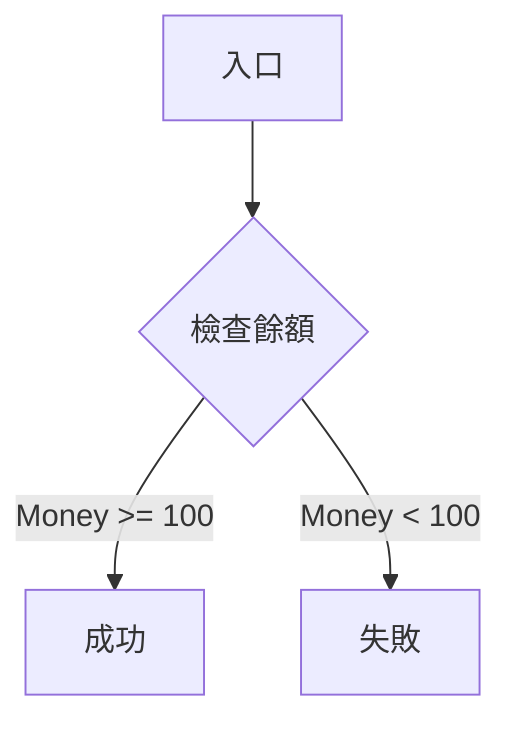
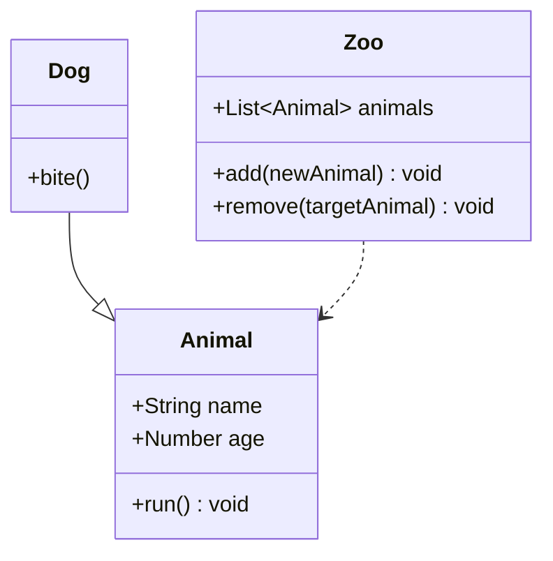
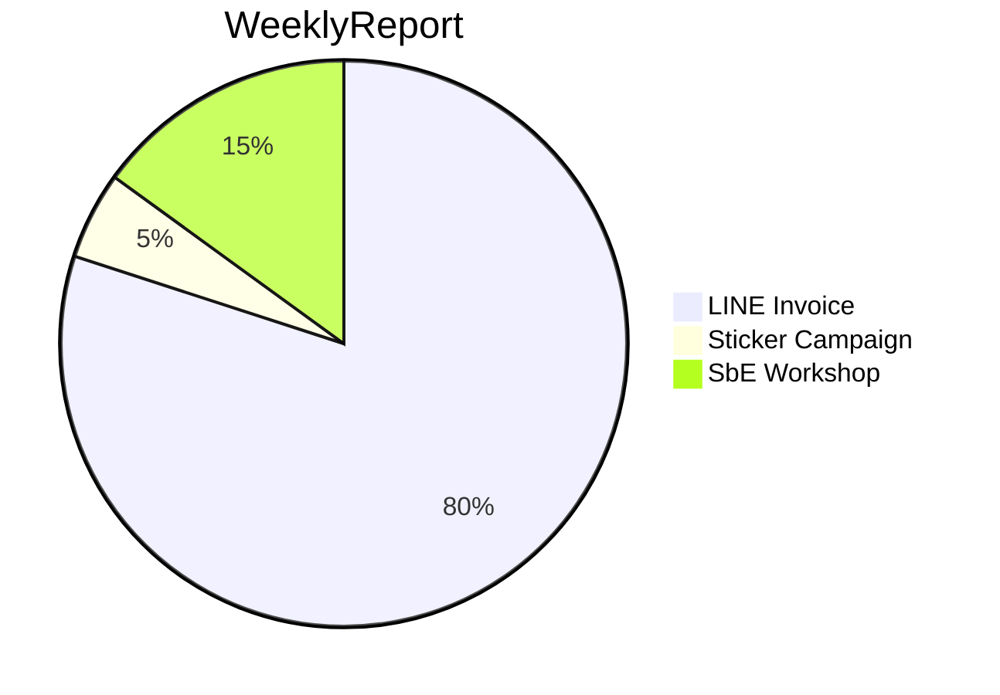

# Mermaid 學習筆記

每一種圖的語法都不太一樣，請先確認需要的圖再進行撰寫


## Flowchart
- [Link](https://mermaid-js.github.io/mermaid/#/flowchart)


## Requirement Diagram
- [Link](https://mermaid-js.github.io/mermaid/#/requirementDiagram)
```
requirementDiagram

requirement MainPage {
    id: mainpage
    text: "主要活動頁面"
    risk: High
    verifymethod: Inspection
}

requirement SorryPage {
    id: sorrypage
    text: "錯誤頁面"
    risk: High
    verifymethod: Inspection
}

functionalRequirement CheckEventTime {
    id: check event time
    text: "檢查活動時間"
    risk: High
    verifymethod: Test
}

element EventTime {
    type: DateFormat
    docref: "define/eventtime"
}

MainPage - contains -> CheckEventTime
CheckEventTime - verifies -> EventTime
CheckEventTime - derives -> SorryPage
```

## Class Diagram
- [Link](https://mermaid-js.github.io/mermaid/#/classDiagram)


## PieChart
- [Link](https://mermaid-js.github.io/mermaid/#/pie)
