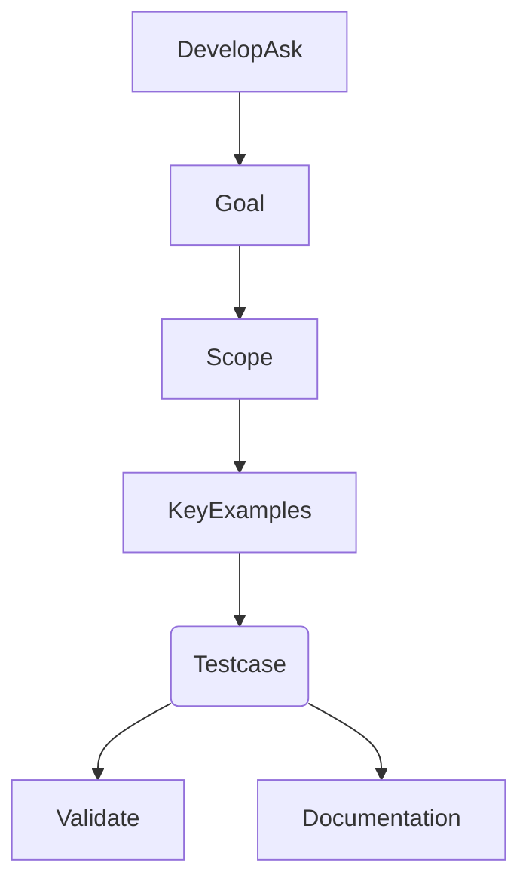

# What is AC - Acceptance Criteria 驗收條件

本篇為學習 AC 後的一些筆記，記錄在這也給大家參考～

## 什麼是 AC
Story 需要滿足客戶和 PO 所想要的狀況(conditions). 這些狀況由一堆敘述所組成, 每個敘述會有很清楚通過和失敗的標準,  讓我們可以度量是否滿足. 這堆敘述稱之為驗收條件

## 什麼時候寫、誰寫？
通常在 PO 列出 user story 時就要對應列出驗收條件，但讓 team 和 PO 共同討論得出的驗收條件，不僅能夠更全面的確保 `關鍵實例` 被包含，也能讓團隊 RD 在開發時有個明確可信賴的測試案例，可以遵循著進行測試，而不僅僅只是為了測試而隨便亂寫一通沒意義的測試

## 介紹
AC 前提中的 `Goal` + `Scope` 就是在確定產品中關鍵行為與範圍，並透過 `Given - 用戶行為` 來討論思考 `keyExamples` 得到共識，最後根據這些實例撰寫 `ExecutableSpec`，並最終經過驗證成為 Documentation

基本的驗收條件包含四大要素
  - 情境（Scenario）
  - 假定（Given）
  - 當（When）- 建議透過實例化案例幫助理解，給予具體的帶入參數，需注意不要進行目的不明確或重複的設定
  - 然後（Then）

## 舉例
假設今天產品有一個頁面功能是`查詢部門預算`，那麼整個功能驗收規劃會像下方這樣

### **情境**
使用者進入查詢頁面

### **假定**
使用者想輸入日期範圍來查詢部門預算

### **當**
1. 輸入日期非整個月，只選擇了部分天數時
2. 輸入日期範圍跨月份時
3. 輸入日期格式錯誤時（eg. end 日期小於 start）
4. 輸入日期中，某一月份尚無預算資料時
5. 輸入日期中，某一月份預算無法整除月份天數時 ....etc

### **然後**
1. 換算該月每天預算值再乘上天數
2. 換算各月預算值乘上該月天數後相加
3. 跳出輸入日期格式錯誤
4. 無資料視為預算 0，返回範圍內其他月份預算加總
5. 每日預算值乘上天數後，再進行無條件捨棄

上面可以看到使用文字描述 `AC` 其實非常不直覺，實務上推薦使用實際具體的帶入參數進行記錄會更容易進行討論理解`關鍵實例`

## 參考圖

## 結論
撰寫 `驗收條件` 的目的在於能夠讓團隊在開發前，能對整個產品的關鍵功能有所共識，雖然花費的時間成本不小，但根據該共識讓後續開發、溝通上的成本大幅度降低
- 找出最小的關鍵實例驗收, 而非整個功能細節
- 避免寫一堆技術細節, 要讓所有人都容易理解
- 專注 What, 而非 How
